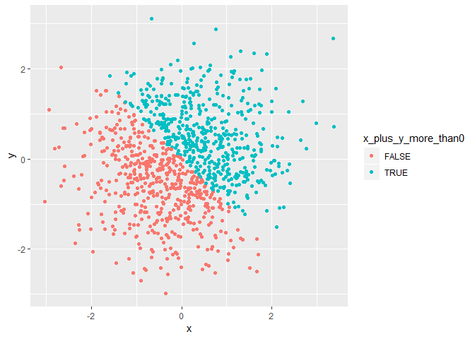
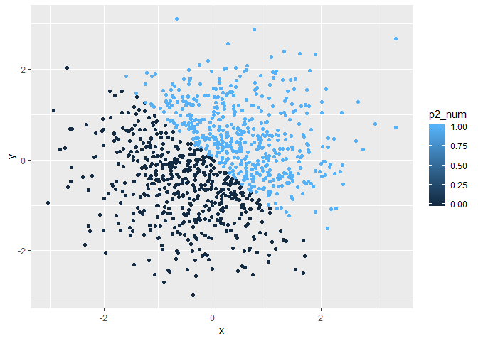
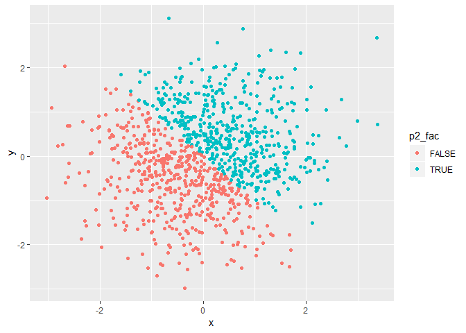

p8105\_hw1\_jy2947
================
Jiawei Ye

This is the first homework of P8105.

Problem 1
---------

The following code chunk creates the data frame as required. It also calculates the mean of each variable in the dataframe.

``` r
dataframe = tibble(
  sample = runif(10, min = 0, max = 5),
  morethan2 = c(sample[1:10] > 2),
  p1_cha = c('JohnyDepp','AlanRickman','Eddie','Benedict','Watson','f','g','h','i','SeverusSnape'),
  p1_fac = factor(c('A','A','C','C','A','B','B','E','E','A'))
)
mean(dataframe$sample)
```

    ## [1] 2.44156

``` r
mean(dataframe$morethan2)
```

    ## [1] 0.7

``` r
mean(dataframe$p1_cha)
```

    ## Warning in mean.default(dataframe$p1_cha): argument is not numeric or
    ## logical: returning NA

    ## [1] NA

``` r
mean(dataframe$p1_fac)
```

    ## Warning in mean.default(dataframe$p1_fac): argument is not numeric or
    ## logical: returning NA

    ## [1] NA

The mean of `sample` and `morethan2` works, `p1_cha` and `p1_fac` do not work and the outputs are `NA`. Obviously you cannot calculate the mean of characters and factors. I think elements in `morethan2` are treated as zeros and ones so R can calculate its mean.

The following code chunk tries to convert logical/character/factor vectors to numerical vectors.

``` r
as.numeric(dataframe$morethan2)
as.numeric(dataframe$p1_cha)
as.numeric(dataframe$p1_fac)
```

The logical vector can be converted to numbers, true = 1, false = 0. The character vector cannot be converted. The factor vector was converted to numbers according to the elements' alphabetic order. When elements in factor vector are numbers, they are converted to the numbers.

The following code chunk tries to convert vectors to other data types.

``` r
tmp1 = as.factor(dataframe$p1_cha)
tmp1
```

    ##  [1] JohnyDepp    AlanRickman  Eddie        Benedict     Watson      
    ##  [6] f            g            h            i            SeverusSnape
    ## 10 Levels: AlanRickman Benedict Eddie f g h i JohnyDepp ... Watson

``` r
as.numeric(tmp1)
```

    ##  [1]  8  1  3  2 10  4  5  6  7  9

``` r
tmp2 = as.character(dataframe$p1_fac)
tmp2
```

    ##  [1] "A" "A" "C" "C" "A" "B" "B" "E" "E" "A"

``` r
as.numeric(tmp2)
```

    ## Warning: NAs introduced by coercion

    ##  [1] NA NA NA NA NA NA NA NA NA NA

Characters can be converted into factors, and they are ordered alphabetically in levels. The characters are first sorted in alphabetic order and then converted to numbers. The factor can be converted to characters but cannot be converted to numeric type (the factors become NA in the numeric vector). But when the elements in factors are numbers in the first place, they can be converted to numbers.

Problem 2
---------

The following code chunk creates the data frame as required.

``` r
norm_distri = tibble(
  x = rnorm(1000),
  y = rnorm(1000),
  x_plus_y_more_than0 = c(x[1:1000] + y[1:1000] > 0 ),
  p2_num = as.numeric(x_plus_y_more_than0),
  p2_fac = as.factor(x_plus_y_more_than0)
)
```

The size of the dataset is 3.389610^{4}. The mean of x is 0.0168009. The median of x is 0.0401466. The proportion of cases for which the logical vector is `TRUE` is 0.515.

The following code chunk creates the scatter plot of `x_plus_y_more_than0` in `norm_distri` and saves the plot in a pdf file.

``` r
ggplot(norm_distri, aes(x = x, y = y, color = x_plus_y_more_than0)) + geom_point()
```



``` r
ggsave("hw1_p2_scatter_plot.pdf", path = './plot')
```

    ## Saving 7 x 5 in image

The following code chunk creates the scatter plot of `p2_num` in `norm_distri`

``` r
ggplot(norm_distri, aes(x = x, y = y, color = p2_num)) + geom_point()
```



The following code chunk creates the scatter plot of `p2_fac` in `norm_distri`

``` r
ggplot(norm_distri, aes(x = x, y = y, color = p2_fac)) + geom_point()
```


